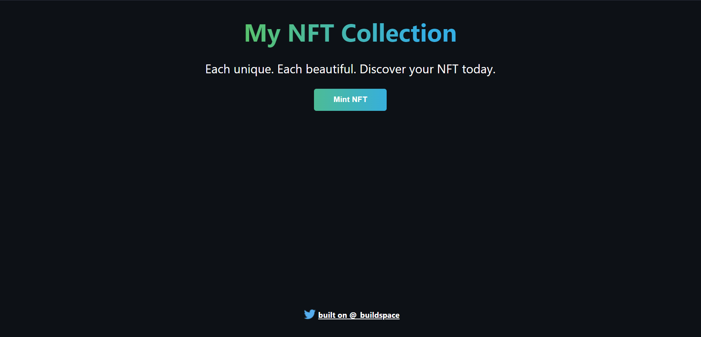

<br />
<div>
  <div align="center">
    <h1 style="font-weight: bold">Mint Your Own NFT Collection (Front-End)</h1>
    <a href="https://github.com/maweiche/ETH-NFT-minting-site">
        
    </a>
    <br />
    <br />
  </div>
</div>

## Table of Contents

- [Table of Contents](#table-of-contents)
- [Getting Started](#getting-started)
- [Questions?](#questions)

<br />

<!-- ABOUT THE PROJECT -->
<h2 align="center"> About The Project </h2>

<p align="center">
    This repository consists of front-end code for <a href="https:/buildspace.so/p/mint-nft-collection">Mint Your Own NFT Collection</a>project on Buildspace. Feel free to clone this repository if you wantto start building something awesome!
    <br />
    <a href="https://github.com/maweiche/ETH-NFT-minting-siteissues">Report Bugs</a>
    ·
    <a href="https://github.com/maweiche/ETH-NFT-minting-siteissues">Request Feature</a>
</p>

<br />

<!-- GETTING STARTED -->

## Getting Started

This is an example of how you can set up your project locally. To get a local copy up and running follow these simple example steps.

1. Clone the repo (Terminal)

```sh
git clone with HTTPS          https://github.com/maweiche/ETH-NFT-minting-site.git
git clone with SSH            git@github.com:maweiche/ETH-NFT-minting-site.git
git clone with Github CLI     gh repo clone maweiche/ETH-NFT-minting-site
```

2. Development (Choose either yarn or npm)

Yarn

```sh
1. yarn install         # Install dependencies for project
2. yarn start           # Starts the app
```

NPM

```sh
1. npm install         # Install dependencies for project
2. npm start           # Starts the app
```

<br />

## Questions?

Have some questions make sure you head over to your [buildspace Dashboard](https://buildspace.so/p/mint-nft-collection) and link your Discord account so you can get access to helpful channels and your instructor!
